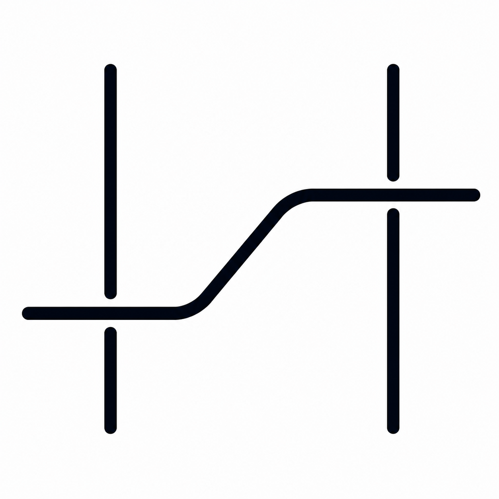

<h3 align="center">
  <em>Driven to build reliable, meaningful technology.</em>
    
  
  
  
  
  
  
</h3>

  
  <big><strong><u>HARIA</u></strong></big>
  &nbsp;—&nbsp;
  <b>Healthcare referral workflow automation</b>

  <a href="https://linkedin.com/in/nilsanz/">
    
    <big><b>/nilsanz</b></big>
  </a>

