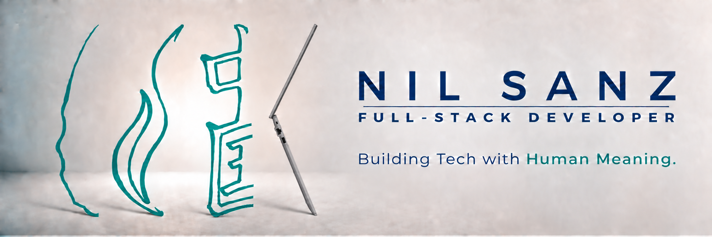

<h3 align="center">
  Full-Stack Developer · Barcelona 
  <em>Driven to build reliable, meaningful technology.</em>
    
  Python · Django · PostgreSQL · HTML · CSS · JavaScript
    
  🏥 <a href="https://github.com/nilsanz/HARIA">HARIA</a> — Healthcare referral workflow automation
    
  <a href="https://linkedin.com/in/nilsanz/">LinkedIn</a>
</h3>
